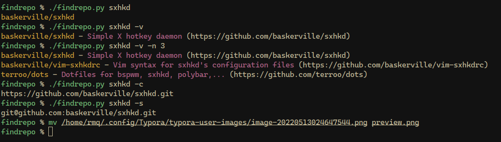

# findrepo

## Usage

Basic usage of findrepo is following `./findrepo.py <search term> [FLAGS]`

### Flags

- `-n int` Number of results
- `-t int` Search type
  - `0` searches repositories
  - `1` searches users

- `-v` Verbose mode: Show description and repository link
- `-d` Disable colors: Colors are enabled by default. This disables them.
- `-c` Show only clone url
- `-s` Show ssh clone url

